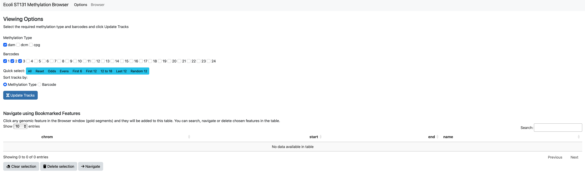
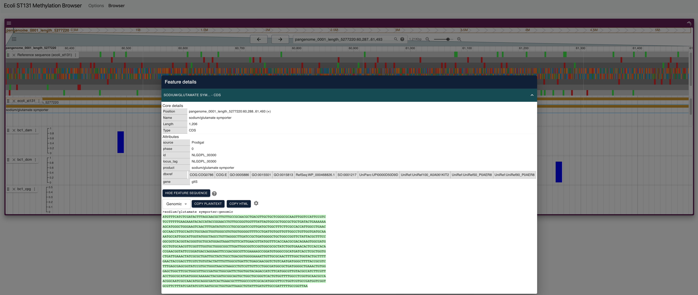
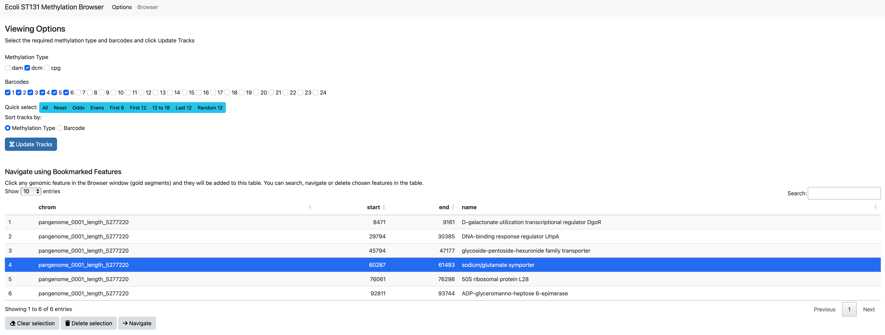
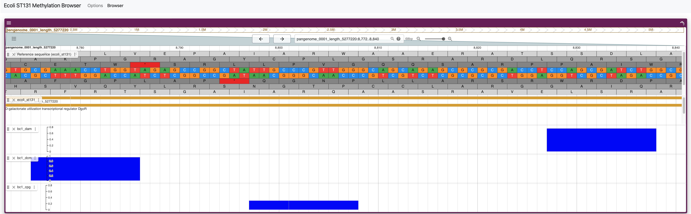

<!-- EDIT THIS FILE, DO NOT EDIT .md -->

# Viewing genome-wide methylation in E. coli ST131

## Deploying the app

To run the [shiny](https://www.rstudio.com/products/shiny/) applet
locally, open [Rstudio](https://posit.co/products/open-source/rstudio/)
and enter the following command in the console:
`shiny::runGitHub("ecoli_st131_methylation", "Sudaraka88")`

If needed, dependencies will be downloaded and installed (once) before
the first run.

A web version of the applet is also available in
[shinyapps.io](https://sudaraka88.shinyapps.io/ecoli_st131_methylation/).
However, using the local version is highly recommended for stability and
speed.

## Walkthrough

If everything works as expected, the app should open in a new RStudio or
Browser window: 

Click on Update Tracks to load the genome, annotation and selected
methylation and barcode tracks. Methylation and barcode selections can
be modified using check boxes and browser view can be updated by
clicking Update Tracks.

The browser view is based on [jbrowse2](https://jbrowse.org/jb2/). There
are standard options to zoom in, out and scroll through regions. It is
also possible to jump to a region by entering the bp position in the
search window as: `(chr:from..to)`. Additionally, any entry in the
genome annotation can be searched using the same search box (E.g. DnaA).

In the browser view, click on any genomic annotation (gold horizontal
bars) to fetch information from the annotation (e.g., gene name,
nucleotide sequence) 

Clicking these annotations will add them to the bookmarks table in the
options page. This can also be used to quickly jump between saved
regions. 

Once an interested region is identified, it is possible to zoom in to
view the nucleotide and AA sequences. The height of methylation (blue
vertical) bars depicts the ratio between methylated and total reads
covering the region. 
